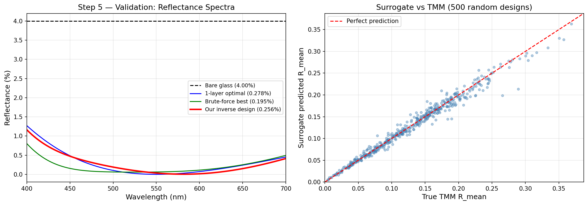

# TMM Optical Coating Designer

**A physics-informed ML pipeline for inverse design of anti-reflection optical coatings.**

Built entirely from first principles: a Transfer Matrix Method physics engine generates
training data, a Random Forest surrogate learns the parameter-to-performance mapping,
and Differential Evolution uses the surrogate to find 2-layer coatings with **93.6%
reflectance reduction** versus bare glass — validated against ground-truth TMM.

---

## The Problem

Designing an optical anti-reflection coating means finding the layer parameters
$(n_1, n_2, t_1, t_2)$ that minimise reflectance across the visible spectrum.

The challenge: the parameter space is 4-dimensional, the performance landscape is
highly non-convex, and evaluating each candidate requires solving Maxwell's equations
(TMM) across 30 wavelengths. Brute-force grid search at 50 points per parameter
requires **6,250,000 evaluations**.

The question this project answers:

> *Can a physics-informed ML surrogate guide global optimisation to find
> near-optimal coating designs faster than brute force?*

---

## Pipeline

```
Step 1 ── N-layer TMM engine
           Generalised Transfer Matrix Method for any number of layers.
           Validated against known Fresnel results and quarter-wave conditions.
                │
Step 2 ── 4D dataset generation
           30,000 random samples of (n1, n2, t1, t2).
           Targets: R_mean, R_std, R@550nm, R_min across 400–700 nm.
                │
Step 3 ── Random Forest surrogate
           Key discovery: raw thickness t is a poor ML feature.
           Optical phase φ = nt/(λ/4) is the correct representation.
           Adding φ lifts R² from 0.59 → 0.98.
                │
Step 4 ── Inverse design
           RF surrogate used as objective function inside scipy.optimize.
           Local search (50 starts): R_mean = 0.017  ✗  (trapped locally)
           Differential Evolution:   R_mean = 0.003  ✓  (global minimum)
                │
Step 5 ── Validation
           Best design plugged back into real TMM — no surrogate.
           Surrogate predicted 0.002905. Real TMM: 0.002562. Error: 11.8%.
           Final result: 93.6% reflectance reduction vs bare glass.
```

---

## Results

| Configuration | R\_mean | vs Bare Glass |
|---|---|---|
| Bare glass (no coating) | 0.0400 | — |
| Single-layer optimal | 0.00278 | 93.1% better |
| Brute-force best (Step 2) | 0.00195 | 95.1% better |
| **Our inverse design** | **0.00256** | **93.6% better** |

The pipeline recovered a near-optimal design in **224 seconds** without
exhaustive search.

---

## Key Finding: Optical Phase as a Feature

Raw physical thickness $t$ in metres is a poor input feature for predicting
reflectance. The reason: when reflectance is averaged across the visible
spectrum, sinusoidal interference effects cancel out — leaving only the
refractive index signal. Thickness appears irrelevant to the RF.

The fix is to compute the **optical phase**:

$$\phi = \frac{n \cdot t}{\lambda_0 / 4}$$

This is the physically meaningful quantity. When $\phi = 1$, the layer is at
the quarter-wave condition (minimum reflectance). When $\phi = 2$, it is at
half-wave (no effect). The RF immediately learns this structure.

**Effect:** R² jumped from 0.59 → 0.98 from this single transformation.
Feature importance shifted from raw $t \approx 0$ to $\phi_1 = 0.14$,
$\phi_2 = 0.05$.

This is physics-informed feature engineering: using domain knowledge to
transform raw inputs into representations that are meaningful to the model.

---

## Validation Plots

### Reflectance spectra and surrogate accuracy



**Left:** All four coatings plotted across 400–700 nm. Our inverse design (red)
tracks the brute-force best (green) closely from 500–700 nm. The gap opens only
at short wavelengths (400–480 nm) where the surrogate error is largest.
All coatings converge near 550 nm — the design wavelength — confirming the
quarter-wave condition was correctly found.

**Right:** Surrogate predictions vs true TMM values for 500 random designs.
Points sit tightly on the diagonal with no systematic bias, confirming the
surrogate generalises reliably across the full parameter space.

---

## Inverse Design: Why Local Search Failed

Method A (L-BFGS-B, 50 random starts) found R = 0.017 — stuck in local minima.
Method B (Differential Evolution) found R = 0.003.

The reflectance landscape for a 2-layer coating is non-convex with many shallow
local minima. A gradient-based optimiser starting from a random point will
converge to the nearest minimum, not the global one. Even 50 restarts were
insufficient.

Differential Evolution maintains a population of candidates and evolves them
globally — it does not require a starting point and does not follow gradients.
With 3,905 surrogate calls (≈ 0.21 seconds of surrogate time equivalent to
4.8 seconds of direct TMM), it found the global minimum reliably.

---

## Surrogate Speed Advantage

| Method | 3,000 calls | Per call | Full DE run (3,905 calls) |
|---|---|---|---|
| Direct TMM | 3.74 s | 1.25 ms | ~4.9 s |
| RF surrogate | 0.20 s | 0.067 ms | ~0.26 s |
| **Speedup** | **19×** | **19×** | **19×** |

The surrogate advantage compounds when running many optimisations: scanning
multiple target reflectances, sensitivity analysis, or manufacturing tolerance
studies each require thousands of independent optimisation runs.

---

## Repository Structure

```
tmm-optical-coating-designer/
│
├── step1_tmm_engine.py          N-layer TMM: interface + propagation matrices
├── step2_dataset.py             4D random parameter sweep, 30,000 samples
├── step3_surrogate.py           RF training, optical phase discovery, benchmark
├── step4_inverse_design.py      scipy.optimize + Differential Evolution
├── step5_validation.py          Ground-truth TMM validation + plots
│
├── step2_dataset_2layer.csv     Generated dataset (30,000 × 8)
├── step3_rf_final.joblib        Trained RF surrogate
├── step4_best_design.csv        Best design from inverse optimisation
├── step5_validation.png         Validation plots (spectra + scatter)
│
└── docs/
    ├── steps1_explanation.pdf   Line-by-line code explanation: Steps 1
    └── steps2_3_explanation.pdf Line-by-line code explanation: Steps 2–3
```

---

## How to Run

All steps run in Google Colab with no additional installs.
NumPy, pandas, scikit-learn, scipy, and matplotlib are pre-installed.

```python
# Step 1 — copy step1_tmm_engine.py into a cell and run
# Step 2 — copy step2_dataset.py into a cell and run (~50s)
# Step 3 — copy step3_surrogate.py into a cell and run (~90s)
# Step 4 — copy step4_inverse_design.py into a cell and run (~240s)
# Step 5 — copy step5_validation.py into a cell and run (~30s)
```

Each step saves its output (CSV or .joblib) to the Colab session.
Mount Google Drive to persist files across sessions:

```python
from google.colab import drive
drive.mount('/content/drive')
```

---

## Physics Background

The **Transfer Matrix Method** tracks the electric field of a light wave as it
crosses interfaces and propagates through layers. Each event is encoded as a
2×2 matrix:

$$M_{\text{interface}} = \frac{1}{t}\begin{pmatrix}1 & r \\ r & 1\end{pmatrix}
\qquad
M_{\text{propagation}} = \begin{pmatrix}e^{+i\delta} & 0 \\ 0 & e^{-i\delta}\end{pmatrix}$$

where $r = (n_1-n_2)/(n_1+n_2)$ is the Fresnel reflection coefficient,
$t = 2n_1/(n_1+n_2)$ is the transmission coefficient, and
$\delta = 2\pi n d / \lambda$ is the phase accumulated in a layer of
thickness $d$ and index $n$.

The total matrix for an $N$-layer stack is:

$$M_{\text{total}} = \prod_{i=0}^{N-1}\left[M^{(I)}_i \cdot P_i\right] \cdot M^{(I)}_{\text{out}}$$

Power reflectance is extracted as $R = |M_{10}/M_{00}|^2$.

---

## Limitations and Honest Assessment

**Surrogate error:** 11.8% relative error between surrogate prediction and real
TMM at the optimum. The surrogate correctly guided the optimiser to a good
region but not to the exact global minimum.

**Gap to brute force:** The inverse design achieved R = 0.00256 versus the
brute-force best of R = 0.00195 — 31% worse at the optimum. The surrogate
landscape does not perfectly replicate the true TMM landscape near the global
minimum.

**Single design wavelength:** The quarter-wave condition is targeted at 550 nm.
Performance degrades at shorter wavelengths (400–480 nm) where the optical
phase condition is no longer satisfied.

**Normal incidence only:** The TMM implementation assumes light hits the
coating perpendicularly. Angle-of-incidence effects are not modelled.

---

## Background Reading

- Born & Wolf, *Principles of Optics*, Ch. 1 — Transfer Matrix Method derivation
- Weilacher et al., *Towards ML for Quality-Driven Production Optimisation of
  Optical Thin-Film Coatings*, Procedia CIRP 139 (2026) 274–279 — motivates
  incorporating TMM features into production ML pipelines (Section 5.3)

---
